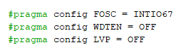
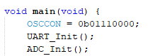
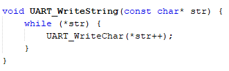

# Lab04: Comunicación UART en PIC18F45K22

## Integrantes

[Maicol Linares](https://github.com/Maiik14)

[Ana Maria Zambrano](https://github.com/anazambranolozano)

[Sergio Florido](https://github.com/sergioflorido)

## Documentación

Este proyecto consiste en la implementación de una comunicación serial básica mediante el protocolo UART utilizando el PIC18F45K22. Con la finalidad de enviar información desde el PIC hacia el computador a través de un convertidor USB-TTL, mostrando mensajes por un programa de terminal como PuTTY.

También implementamos una simulación de comunicación UART utilizando el I2C, como una alternativa para casos donde los pines de UART requieran una comunicación entre múltiples dispositivos esclavos con un maestro único. Aunque UART e I2C son protocolos diferentes, este ejercicio nos permitió adaptar el comportamiento de UART al canal I2C de forma controlada, transmitiendo caracteres simulando una transmisión serial.

`Descripción del Funcionamiento`

Configuramos el oscilador interno del PIC a 16 MHz.

Habilitamos la comunicación UART a 9600 bps.

Se envío un mensaje de prueba (“Hola, UART funcionando!”).

En paralelo, implementamos un segundo canal de comunicación usando I2C simulando la funcionalidad de UART, enviando los mismos caracteres hacia un dispositivo esclavo que actúa como receptor

 `main.c – Programa principal`[main.c](/code/Main.c)

Configuramos el reloj interno del PIC a 16 MHz y llamamos a la función UART_Init() para preparar la comunicación serial. Luego, en un bucle infinito, el microcontrolador envió cada segundo el mensaje “Hola, UART funcionando!” al puerto serial.

También incluimos una llamada a UART_I2C_Send() para enviar el mismo mensaje a través del  I2C, utilizando la dirección de un esclavo previamente configurado. Esto permitió observar el mismo mensaje desde un segundo canal simulado, útil para monitoreo.

El código lo realizamos de la siguiente forma:

Este encabezado permite la inclusión de liberias para traer al archivo Main

Son inscrucciones directas de configuración al Microcontrolador del pic18f45k22

`OSCCON = 0b01110000;` Es el oscilador interno configurado en 16MHz

`UART_Init();` Se encarga de inicializar el UART

`ADC_Init();` Se encarga de inicializar el ADC

`uint16_t adcValue = ADC_Read();` se llama a la función en ADC_Read para tomar el valor digital en éste

`float voltage = (adcValue * VREF) / ADC_RESOLUTION;` Realiza la conversión del valor que hay en el ADC a un voltaje real 

`char voltageString[20];`Asignación de un espacio para texto

`sprintf(voltageString, "Voltaje: %.2f V\r\n", voltage);`Convierte el valor numerico en caracteres para poder imprimir en la LCD

`UART_WriteString(voltageString);`Envía informmación obtenida por el puerto serie

`__delay_ms(1000);` Es la espera de 1 segundo

`uart.c y uart.h – Comunicación UART`
[uart.c](/code/uart.c) 
[uart.h](/code/uart.h)

Se configuró el pin de transmisión (TX) como salida y el de recepción (RX) como entrada. Se ajustó la velocidad de comunicación (9600 baudios) y se activaron tanto la transmisión como la recepción.

Las funciones incluidas permitieron enviar caracteres, cadenas de texto, números enteros y voltajes en decimales.

 

Este encabezado permite la inclusión de liberias

Modulo encargado de realizar la asignación y confiiguración de inicio para el UART

 `TRISC6 = 0;` Asiganción del puerto para que sea una salida
 `TRISC7 = 1;` Asignación del puerto para que sea una entrada

Modulo envargado del buffer de transmisión

Modulo encargado de enviar caracter por caracter

Modulo encargado de convertir el número a caracter y enviarlo

Modulo encargado de convertir el voltaje en caracter y enviarlo

`adc.c y adc.h – Conversión Analógica-Digital` 
[adc.c](/code/adc.c)
[adc.h](/code/adc.h)

Se configuró el canal AN0 como entrada analógica y se activó el módulo ADC para obtener una medición. Al llamar a ADC_Read(), el sistema inició una lectura y esperó hasta que el resultado estuviese listo, devolviendo un número de 10 bits (de 0 a 1023), que representó la magnitud de la señal medida.

## Implementación

La implementación consistió en conectar el microcontrolador PIC18F45K22 con un adaptador USB-TTL para enviar mensajes desde el PIC. Se usaron los pines RC6 y RC7 para transmitir y recibir datos, y se alimentó el sistema con 5V. Una vez cargado el programa, el PIC comenzó a enviar cada segundo el mensaje “Hola, UART funcionando!”, el cual se pudo ver correctamente en el monitor serial.

Adicionalmente, el mismo mensaje lo enviamos por I2C a un dispositivo esclavo simulado, permitiendo comparar ambos canales.

[Video de Uart.mp4](/Video%20de%20Uart.mp4)

