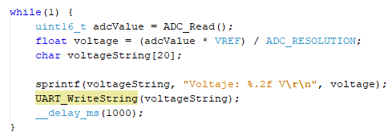
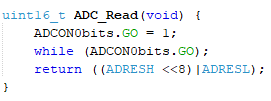
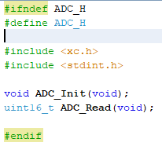

# Lab04: Comunicación UART en PIC18F45K22

## Integrantes

[Maicol Linares](https://github.com/Maiik14)

[Ana Maria Zambrano](https://github.com/anazambranolozano)

[Sergio Florido](https://github.com/sergioflorido)

## Documentación

Este proyecto consiste en la implementación de una comunicación serial básica mediante el protocolo UART (Universal Asynchronous Receiver Transmitter) usando el microcontrolador PIC18F45K22. La finalidad es enviar información desde el PIC hacia una computadora a través de un convertidor USB-TTL, mostrando mensajes por un programa de terminal como PuTTY.

`Descripción del Funcionamiento`

Configuramos el oscilador interno del PIC a 16 MHz.

Habilitamos la comunicación UART a 9600 bps.

Se envío un mensaje de prueba (“Hola, UART funcionando!”).

En paralelo, implementamos un segundo canal de comunicación usando I2C simulando la funcionalidad de UART, enviando los mismos caracteres hacia un dispositivo esclavo que actúa como receptor

 `main.c – Programa principal`[main.c](/code/Main.c)

Aquí se inicia todo. Se configura el reloj interno del PIC a 16 MHz y se llama a la función UART_Init() para preparar la comunicación serial. Luego, en un bucle infinito, el microcontrolador envía cada segundo el mensaje “Hola, UART funcionando!” al puerto serial. Esto sirve como prueba de que la UART está funcionando correctamente. 

Encabezado encargado de incluir librerias como Uart y ADC

Encabexado encargado de configurar el microcontrolador pic18f45k22

Encabezado encargado de asignar el voltar¿je y la resolución 

`OSCCON = 0b01110000;` Configura el oscilador en 16MHz
`UART_Init();` Inicia el modulo UART
`ADC_Init();` Inicia el modulo ADC

`uint16_t adcValue = ADC_Read();` Lee el valor que hay en el ADC

`float voltage = (adcValue * VREF) / ADC_RESOLUTION;` Convierte el voltaje recibido

`char voltageString[20];` Guarda los caracteres 

`sprintf(voltageString, "Voltaje: %.2f V\r\n", voltage);` Se encarga de convertir a el valor numerico del voltaje a caracteres para mostrarlos en la LCD

`UART_WriteString(voltageString);` Sen encarga de enviar la información al UART

`__delay_ms(1000);` Se encarga de detener el tiempo de 1 segundo

`uart.c y uart.h – Comunicación UART`
[uart.c](/code/uart.c) 
[uart.h](/code/uart.h)

Este módulo permite que el microcontrolador se comunique con el computador u otro dispositivo a través del puerto serial (UART). Primero, se configura el pin de transmisión (TX) como salida y el de recepción (RX) como entrada. Se ajusta la velocidad de comunicación (9600 baudios) y se activan tanto la transmisión como la recepción. Además, se habilitan las interrupciones para que el microcontrolador pueda reaccionar cuando llega un dato. Las funciones incluidas permiten enviar caracteres individuales, cadenas de texto completas, números enteros (como texto) y voltajes en formato decimal, facilitando una comunicación clara y ordenada con el usuario o un programa de monitoreo en el PC.

Encabezado para incluir librerias

Modulo encargado de la transmisión y recepción del serial 

`TRISC6 = 0;` Asigna el pin como una salida
`TRISC7 = 1;` Asigna el pin como una entrada

Modulo encargado de transitir los caracteres al buffer

Modulo encargado de transmitir los caracteres uno por uno

Modulo encargado de convertir los valores del buffer

Modulo encargado de convertir los valores del voltaje 

Asignación de las funciones indicadas, ademas de encargarse de poder ser enviadas al modulo principal MAIN

`adc.c y adc.h – Conversión Analógica-Digital` 
[adc.c](/code/adc.c)
[adc.h](/code/adc.h)

Se configuró el canal AN0 como entrada analógica y se activó el módulo ADC para obtener una medición. Al llamar a ADC_Read(), el sistema inició una lectura y esperó hasta que el resultado estuviese listo, devolviendo un número de 10 bits (de 0 a 1023), que representó la magnitud de la señal medida.

Encabezado encargado de incluir las librerias

Modulo de inicio para el ADC 

Modulo encargado de conversión para el ADC

Asignación de las funciones indicadas, ademas de encargarse de poder ser enviadas al modulo principal MAIN

## Implementación

La implementación consistió en conectar el microcontrolador PIC18F45K22 con un adaptador USB-TTL para enviar mensajes desde el PIC. Se usaron los pines RC6 y RC7 para transmitir y recibir datos, y se alimentó el sistema con 5V. Una vez cargado el programa, el PIC comenzó a enviar cada segundo el mensaje “Hola, UART funcionando!”, el cual se pudo ver correctamente en el monitor serial.

Adicionalmente, el mismo mensaje lo enviamos por I2C a un dispositivo esclavo simulado, permitiendo comparar ambos canales.

[Video de Uart.mp4](/Video%20de%20Uart.mp4)

## Conclusiones

- Pudimos evidenciar como una señal analoga puede ser visualizada en una señal digital
- Evidenciamos los cambios del voltaje que se hacian con el potenciometro de manera digital por medio del programa PuTTY

